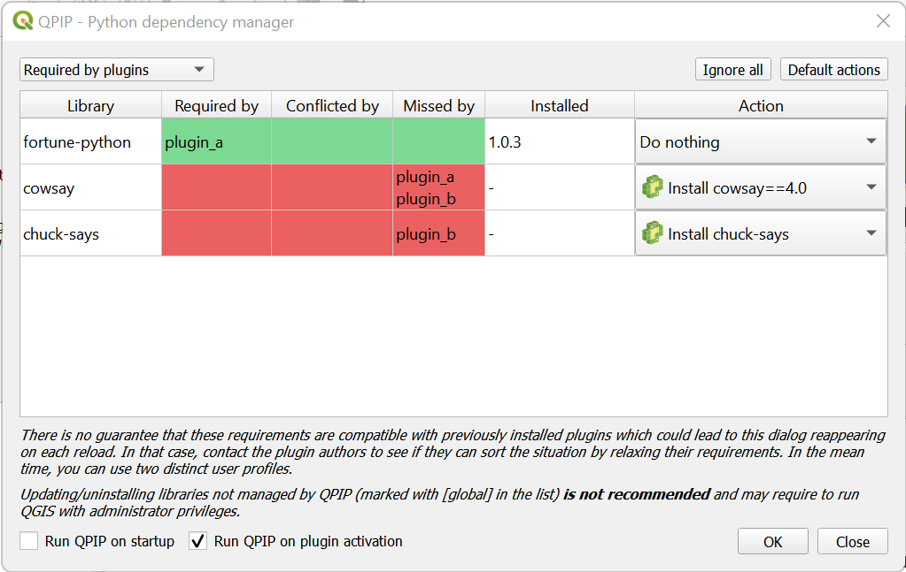

# QPIP

**QPIP** is a QGIS plugin allowing to manage Python dependencies for other plugins.

When loading other plugins, it will check if a `requirements.txt` file exists in its directory. If so, it will verify if the dependencies are met, and display a dialog offering to install missing requirements.

All requirements are installed in the user's profile (under `python/dependencies`), so that each user profile can have a different set of dependencies.


## Usage (end user)

Install `QPIP` through the QGIS plugin manager. Once installed, by default, dependencies will be checked automatically when activating new plugins.

### Plugin menu

A `QPIP` entry will appear in the plugin menu :
- **Run dependencies check now** : Run the check manually, which opens the main dialog offering to install/upgrade missing requirements.
- **Show library folder in explorer** : Opens the dependencies folder in your profile path. If you run into trouble, you can delete everything contained in that folder to remove everything installed by QPIP.

### Main dialog



The main dialog shows a list of Python libraries with the following columns:
- **Library** the name of the Python library
- **Required by** the list of QGIS plugins that require this dependency (dependency met)
- **Conflicted by** the list of QGIS plugins that require this dependency but in an incompatible version (it **may** still work, but the plugin is likely to fail)
- **Missed by** the list of QGIS plugins that miss this dependency but in an incompatible version (the plugin **may** partially work, but some features definitely won't)
- **Installed** the version currently available on your system (system-wide python libraries are marked with `[global]`)
- **Action** the action that will be taken once you click on "OK".

You can filter the list to either show only missing/conflicting dependencies, or to include system wide python libraries even if not directly required by a QGIS plugin. Note that you should not uninstall/upgrade system wide python libraries unless you know what you are doing (it may require administrator privileges).

You can also configure when QPIP should automatically check for dependencies.


## Usage (how to integrate in your own QGIS plugin)

Add `plugin_dependencies=qpip` to your plugin's `metadata.txt` to ensure your user will have QPIP installed upon installation of your plugin.

Add a `requirements.txt` file in your plugin directory (see [an example](https://pip.pypa.io/en/stable/cli/pip_install/#example-requirements-file)).

**Important** : make sure to keep your requirements as loose as possible, as to minimise the risk of requirements conflicts with other plugins. Also, avoid requiring libraries that may conflict with core QGIS dependencies such as GDAL, as it could lead to instabilities.


## Limitations

QPIP handles each plugin independently. If two plugins have incomptabile requirements, the user will have to choose which version will be installed, likely breaking the other ones. In such cases, you should contact the plugin authors, and see if they can make their dependencies compatible. Alternatively, you can install each plugin in a different user profile.


## How it works internally

- QPIP is installed under the `a00_qpip` directory, so that it (hopefully) loads first
- `USERPROFILE/python/dependencies/Lib/site-packages` is added to sys.path
- `USERPROFILE/python/dependencies/Scripts` is added to the PATH
- `qgis.utils.loadPlugin` is monkeypatched, injecting code that checks requirements in `requirements.txt` using `pkg_resources`
- if requirements are met, the plugin is loaded directly
- if requirements are not met, the dialog is shown to the user*
  - on confirmation, selected libraries are installed with `pip [...] --prefix USERPROFILE/python/dependencies`
  - the plugin is then loaded

*during startup (with the `Run QPIP on startup` option), the dialog is deferred to after GUI initialisation


## Contribute

Style is enforced by pre-commit :
```
pip install pre-commit
pre-commit install
```

Deployements to QGIS plugin repository are made automatically by Github workflows when tags matching `v*` are pushed.


## Roadmap

- [ ] automated tests on supported QGIS versions
